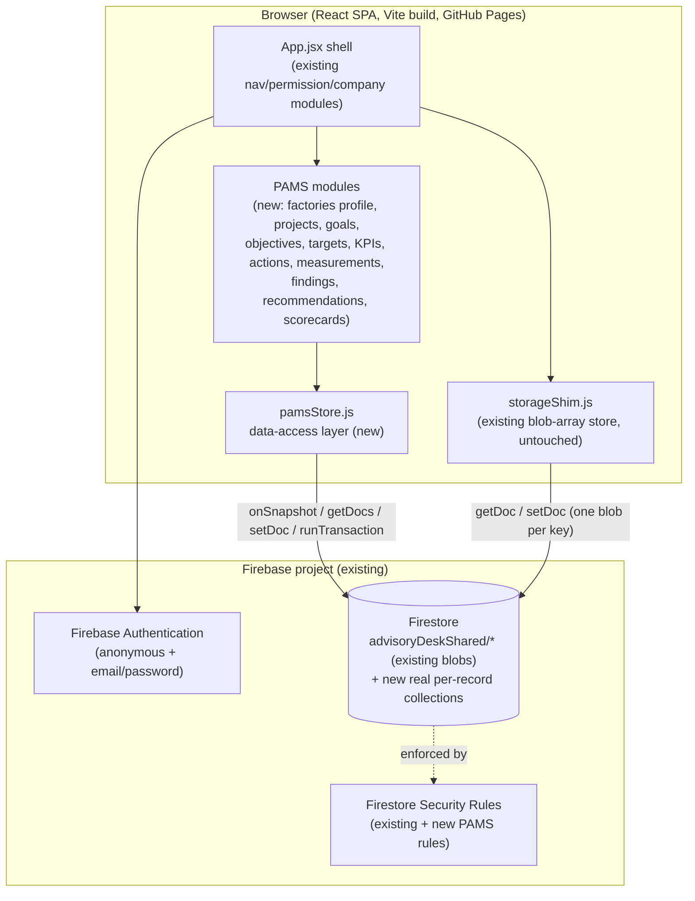

# PAMS — Architecture

## 1. System context



PAMS adds **no new infrastructure**. Same Firebase project, same
Firestore database, same Vite build, same GitHub Pages deployment, same
Authentication setup. What's new is a second, parallel data-access
pattern living alongside `storageShim.js` — see §2.

## 2. Why PAMS does not use `storageShim.js`'s blob-array pattern

Today, every ASMS entity type (`companies`, `caps`, `riskAssessments`,
...) is stored as **one Firestore document** whose `value` field holds
`JSON.stringify(entireArrayOfAllRecordsOfThatType)`. Every single
create/update/delete rewrites and re-uploads the whole array
(`App.jsx`'s `update()` helper). This works today because ASMS's
existing modules are shallow — tens to low hundreds of records per
type across all companies combined.

PAMS is not shallow. A single factory's advisory project, over its
lifetime, is expected to have:

- Dozens of goals/objectives/sub-objectives/targets
- A KPI library shared across dozens of factories
- Hundreds of actions and tasks
- **Thousands of periodic measurements** (one row per KPI per target
  per period, accumulating monthly/quarterly over a multi-year
  program, across all factories)
- **Thousands of evidence records** (every measurement, action, and
  finding can carry evidence)

Two hard limits make the existing pattern unsafe for this:

1. **Firestore's 1 MiB per-document limit applies to the whole
   collection at once**, not per record — this is already flagged as
   a known risk in ASMS's own README for the visit-attachments case,
   which is why attachments already live in separate per-parent
   documents rather than the `visits` blob. PAMS's Measurement/Evidence
   volume would hit this ceiling within the first few months of a
   single active program, not as a distant scaling concern.
2. **No concurrent-write safety.** Two advisors entering measurements
   for two different KPIs at the same moment both rewrite the *entire*
   `pams_measurements` array; the second write silently discards the
   first's change (last-write-wins on the whole blob, no merge, no
   Firestore transaction protecting the read-modify-write). This is
   tolerable today because ASMS's actual write frequency and
   concurrency are low; it is not tolerable for a module whose whole
   purpose is many advisors entering many periodic measurements.

**Decision: every PAMS entity is a real, individual Firestore document**
in its own top-level collection (`pams_projects/{id}`, `pams_goals/{id}`,
`pams_measurements/{id}`, ...), written and read directly via the
Firestore SDK (`collection()`, `doc()`, `setDoc()`, `getDocs()`,
`query()`, `onSnapshot()`, `runTransaction()`), never through
`storageShim.js`. This is a strictly additive change — nothing about
`storageShim.js` or the existing 20 blob-keyed modules changes. See
[DOMAIN_MODEL.md](DOMAIN_MODEL.md) for the full collection list.

Consequences this decision buys:

- No document ever approaches the 1 MiB limit (each Measurement,
  Evidence, Action, etc. is its own small document).
- Firestore's real per-document write path + `runTransaction()` where
  needed (e.g. score recalculation, see SCORING_ENGINE.md §6) replaces
  "hope nobody edits at the same moment."
- Real Firestore queries (`where()`, `orderBy()`, `limit()`,
  `startAfter()`) become possible for the first time in this app,
  which is what makes drill-down, pagination, and per-factory scoping
  practical at PAMS's volume — the existing pattern's "load the whole
  array into React state and `.filter()` in memory" approach does not
  scale past a few hundred records per type, and PAMS expects
  thousands.
- Firestore Security Rules can finally be written per-collection with
  field-based conditions (`resource.data.factoryId in ...`), which the
  single monolithic blob document made structurally impossible before
  (see SECURITY.md §5).

The cost: a second data-access pattern exists in the codebase
side-by-side with the first. This is treated as acceptable and
intentional — retrofitting all 20 existing ASMS modules onto real
per-record documents is out of scope for PAMS and not requested; PAMS
introduces the better pattern for its own new collections without
requiring a disruptive rewrite of working, shipped modules.

## 3. The PAMS data-access layer (`pamsStore.js`) — the "API" for a
   backend-less app

The originating brief asked for a REST API surface
(`/api/factories`, `/api/goals`, ...). ASMS has no server to host one.
The equivalent, adapted seam is a single new module,
`src/pams/pamsStore.js`, that is the *only* code in the app allowed to
call the Firestore SDK for PAMS collections — every PAMS screen goes
through it, the same way every existing screen goes through
`ctx.update()`/`window.storage`. This gives the same benefit a REST API
gives a client (one seam to add validation, permission checks, audit
logging, and score-recalculation triggers) without needing a server to
run it on.

Representative shape (illustrative, finalized during Phase 2
implementation):

```js
// src/pams/pamsStore.js — one function group per entity type
export const factories = {
  get: (id) => getDoc(doc(db, "pams_factories", id)),
  list: (filters) => query(collection(db, "pams_factories"), ...whereClausesFrom(filters)),
  create: (data) => addDoc(collection(db, "pams_factories"), withAuditFields(data)),
  update: (id, patch) => updateDoc(doc(db, "pams_factories", id), withAuditFields(patch)),
};

export const measurements = {
  // Never update-in-place: every submission is a new document,
  // preserving history per PAMS's "never overwrite previous
  // measurements" requirement (brief §21).
  create: (data) => runTransaction(db, async (tx) => {
    const measurementRef = doc(collection(db, "pams_measurements"));
    tx.set(measurementRef, withAuditFields(data));
    // Recompute and write the target's cached score summary in the
    // same transaction — see SCORING_ENGINE.md §6.
    ...
  }),
  listForTarget: (targetId, periodRange) => query(
    collection(db, "pams_measurements"),
    where("targetId", "==", targetId),
    orderBy("period", "desc"),
    ...(periodRange ? [where("period", ">=", periodRange.from), where("period", "<=", periodRange.to)] : []),
  ),
};

export const evidence = { /* upload to Firebase Storage (new — see §4) + create pams_evidence doc, same shape */ };
export const scores = { /* read-only — written only by the scoring engine, never edited directly, see SCORING_ENGINE.md */ };
```

Every write function funnels through `withAuditFields()`, which stamps
`createdBy/createdAt/updatedBy/updatedAt` from the current session —
the PAMS equivalent of the audit-log requirement, since there is no
server-side interceptor to do this automatically (contrast with a real
backend's `SaveChangesInterceptor`-style pattern). Full change-history
(not just last-write metadata) is handled by the version-snapshot
pattern in DOMAIN_MODEL.md §7, not by this stamp alone.

## 4. File/evidence storage: Firebase Storage, not Firestore

ASMS today stores photo/file attachments as base64 `dataUrl` strings
inside Firestore documents (compressed client-side first). This is
workable at the existing small scale (max 8 photos/visit, max 4
files/question) but PAMS's evidence volume (every measurement, action,
and finding can carry evidence, across thousands of records) makes
that pattern unsustainable — base64-in-Firestore is ~33% larger than
the original file and would multiply the 1 MiB pressure discussed in
§2 many times over.

**Decision: PAMS evidence files upload to Firebase Storage** (a real
object-storage bucket, already part of every Firebase project — no new
service to provision), with the Firestore `pams_evidence` document
holding only metadata + the Storage download URL:

```js
{
  id, title, type, period, uploadedBy, uploadedAt,
  storagePath: "pams-evidence/{factoryId}/{entityType}/{entityId}/{evidenceId}.{ext}",
  downloadUrl, mimeType, sizeBytes,
  verificationStatus, verifiedBy, verifiedAt, verifierComment,
}
```

This is the direct Firestore-world equivalent of the brief's "S3-compatible
object storage" requirement (§40, §83) — Firebase Storage *is*
S3-compatible-in-spirit object storage, already available in this
Firebase project at zero additional infrastructure cost.

## 5. What replaces "background jobs" (Hangfire)

There is no server, so nothing can run on a schedule or in a worker
process. Two of the brief's background-job use cases are handled
differently:

- **Escalation on overdue actions/targets (brief §56):** computed
  *on read*, not on a schedule — every dashboard/list view that shows
  an Action or Target computes its escalation level from
  `dueDate`/`status` at render time (the same pattern `capStatusOf()`
  already uses for "Overdue" today). No stored "escalation ran" state
  is needed since it's a pure function of current data.
- **Notifications (brief §55):** in-app only for v1 (a `pams_notifications`
  collection, rendered as a bell/badge, matching how a real-time
  Firestore listener naturally behaves — no polling job needed since
  `onSnapshot()` pushes changes live). Email/SMS notification (the
  brief's "optional SMS/API") is explicitly deferred — it would need a
  Cloud Function trigger (a real, small server-side compute unit
  Firebase does support without a separate backend) and is scoped as a
  Phase 10+ follow-up, not v1.

## 6. Dashboard/report performance without a query-optimizing database

Firestore has no `JOIN`, no server-side aggregation beyond simple
counters, and every query is billed and rate-limited per read. A
factory scorecard that naively re-read and re-aggregated every
Measurement, Action, and Score document on every dashboard view (the
brief's own §86 warning: *"do not calculate extremely expensive
historical reports synchronously on every dashboard request"*) would
be slow and expensive at PAMS's real volume.

**Decision: materialized summary documents**, written by the scoring
engine whenever a measurement or score changes (client-side, inside
the same transaction described in §3 and SCORING_ENGINE.md §6), never
computed live on dashboard render:

```
pams_factory_summaries/{factoryId}
  → { overallScore, overallRating, ragStatus, domainScores: {...},
      openActions, overdueActions, openFindings, openCaps,
      lastRecalculatedAt, scoringRuleVersion }

pams_target_summaries/{targetId}
  → { latestActual, latestPeriod, achievementPct, score, rating, rag,
      trend: [{period, actual, score}, ...last 12] }
```

The factory dashboard reads one small document per factory instead of
recomputing from thousands of measurement rows. Drill-down (brief §74)
still reads the real underlying records — the summary is a cache for
the top-level view, not a replacement for traceability.

## 7. Scale envelope this architecture is actually designed for

Stated honestly, per PRD.md §3: this is a client-heavy Firestore app on
Firebase's free/low-tier pricing model, not a system built for the
brief's literal "hundreds or thousands of factories, millions of
measurements" (§67). The realistic, explicitly-targeted envelope is:

- Tens to low hundreds of factories
- Low hundreds of KPIs in the shared library
- Tens of thousands of measurements total (not per factory — across
  the whole deployment, accumulated over years)
- Evidence files in the low thousands, each individually small
  (compressed images, PDFs, typical office documents)

This comfortably covers a real advisory program's realistic caseload.
If a future deployment genuinely needs the brief's literal enterprise
scale (hundreds of factories, millions of rows), that is the trigger
condition for revisiting the "new dedicated backend" option the user
already declined for v1 — not a reason to over-build this one now.
