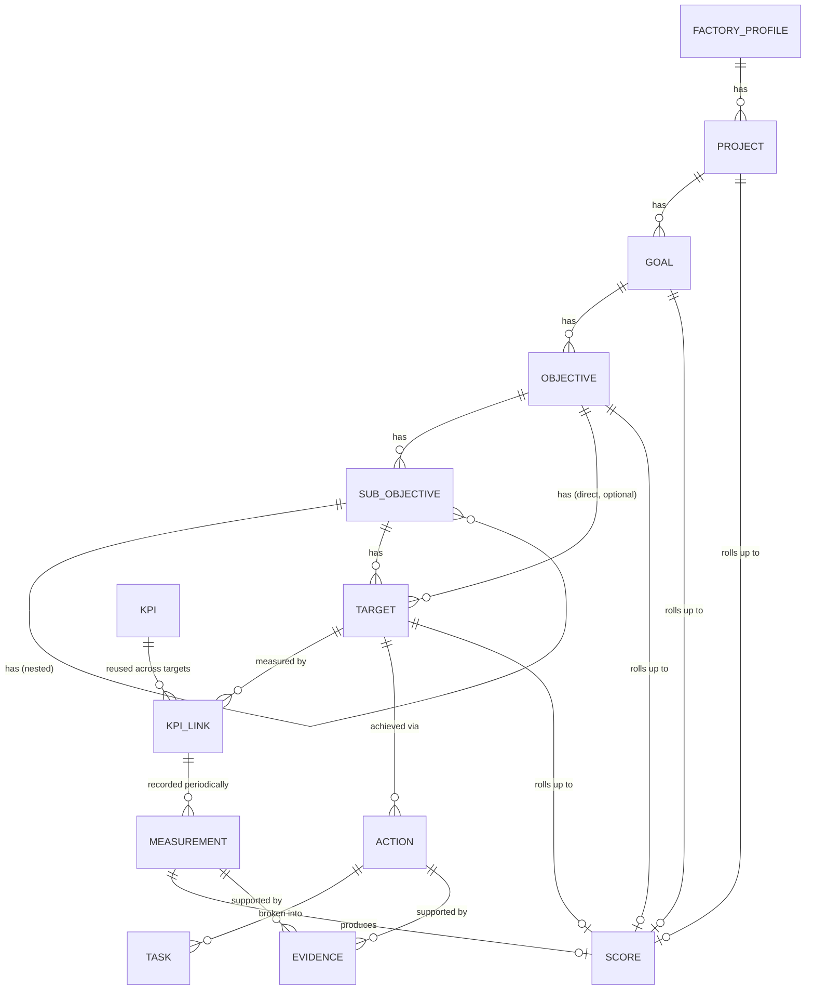
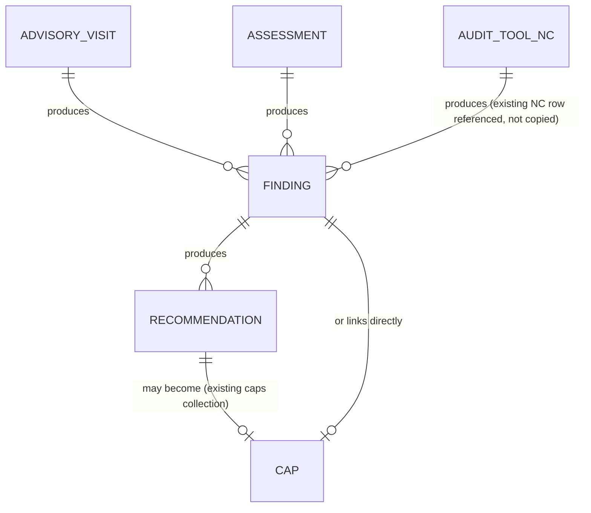

# PAMS — Domain Model & Firestore Schema

All relationships in this document are **logical, not database-enforced**
— Firestore has no foreign keys. Every reference field (`factoryId`,
`targetId`, ...) is a plain string holding another document's ID, and
integrity is the responsibility of `pamsStore.js` (ARCHITECTURE.md §3),
not the database. This is called out once, here, rather than repeated
on every entity below.

Every collection listed is real per-record Firestore documents
(ARCHITECTURE.md §2) unless explicitly marked **[embedded]**, which
means it lives as an array field inside its parent document — used only
where the array is provably bounded (a fixed catalog snapshot), never
for anything that accumulates over time.

## 1. How PAMS extends existing ASMS entities

| Existing collection (untouched) | PAMS addition | Mechanism |
|---|---|---|
| `companies` (blob key) | `pams_factory_profiles/{companyId}` | Separate 1:1 document, doc ID = the company's existing ID. Joined by ID at render time. Zero changes to `CompanyForm`/`companies` blob. |
| `advisoryInfo` (blob key, "Advisory Cycle") | `pams_projects` gets an optional `advisoryInfoId` field | A Project may reference an existing cycle; cycles keep working standalone as they do today. |
| `caps` (blob key, "Improvement Plan") | Two new optional fields: `findingId`, `recommendationId` | Additive fields on the existing CAP record/form only — see §6. The `caps` collection itself, its statuses, and its existing screens are otherwise unchanged. |
| `riskAssessments` (blob key) | Two new optional fields: `objectiveId`, `targetId` | Same additive pattern — links a risk into the new hierarchy without touching existing risk-register behavior. |
| `visits` (blob key, free-text log) | New, separate `pams_advisory_visits` collection | Kept separate rather than migrated in place — see §5 for why. |

## 2. Core performance hierarchy



### `pams_factory_profiles/{companyId}`

```
factoryId (= companyId, doc ID)
industryType            "Garment" | "Footwear" | "TravelGoods" | "Textile" | "Other"
industryProfileId       → pams_industry_profiles (configurable per-type defaults, §9)
legalName, brand, ownership, parentCompanyGroup
country, province, district
generalManagerName, hrManagerName, complianceManagerName, productionManagerName
workerCountTotal, workerCountMale, workerCountFemale
productionLineCount, productionCapacity, mainProducts, mainExportMarkets
workingHours, shiftStructure
factoryStatus           "Active" | "Inactive" | "Exited"
programEnrollmentDate, programExitDate
advisoryStatus, riskClassification
factoryGroupId          → pams_factory_groups (nullable — brief §5)
createdBy, createdAt, updatedBy, updatedAt
```

### `pams_factory_groups/{id}` and `pams_departments/{id}`

```
// pams_factory_groups
{ id, name, parentOrganization, memberFactoryIds: [companyId, ...] }

// pams_departments — factory-scoped, admin-extensible catalog
{ id, factoryId, name, code, isSystemDefault (bool), createdBy, createdAt }
```

Default department names (Administration, HR, Production, Cutting,
Sewing, ... per brief §6) are seeded once as `isSystemDefault: true`
rows per factory at factory-creation time, then freely editable —
avoids a separate "global catalog vs. factory override" join for what
is, in practice, always edited per-factory.

### `pams_programs/{id}` and `pams_projects/{id}`

```
// pams_programs — optional grouping above Project, for a donor/client program spanning factories
{ id, name, client, donor, startDate, endDate, status }

// pams_projects — "Advisory Project"
{
  id, code, name, projectType, factoryId, programId (nullable), advisoryInfoId (nullable, links existing cycle),
  clientOrDonor, projectManagerUserId, advisorUserIds: [userId, ...],
  startDate, endDate, budget, status, priority, description, expectedOutcomes,
  createdBy, createdAt, updatedBy, updatedAt,
}
```

### `pams_goals/{id}`

```
{
  id, code, factoryId, projectId, title, description, strategicArea,
  baseline, expectedOutcome, weight, startDate, endDate, ownerUserId,
  status, currentAchievement,       // denormalized from latest score, refreshed by scoring engine
  scoreId (→ pams_scores, latest),  // see SCORING_ENGINE.md
  createdBy, createdAt, updatedBy, updatedAt,
}
```

### `pams_objectives/{id}`

```
{ id, goalId, code, title, description, ownerUserId, baseline, target, weight,
  startDate, endDate, status, progress, scoreId, createdBy, createdAt, updatedBy, updatedAt }
```

### `pams_sub_objectives/{id}` — arbitrary depth

```
{ id, objectiveId,              // always set: the top-level objective, for flat querying
  parentSubObjectiveId,          // nullable: set when nested under another sub-objective
  code, title, description, ownerUserId, baseline, target, weight,
  startDate, endDate, status, progress, scoreId, createdBy, createdAt, updatedBy, updatedAt }
```

Depth is not capped in the schema (brief §13: "do not unnecessarily
restrict... to only one sub-objective level"). `objectiveId` is
denormalized onto every level (not just the immediate parent) so "all
sub-objectives under this objective, any depth" is one indexed query
(`where("objectiveId","==",...)`) instead of a recursive fetch.

### `pams_targets/{id}`

```
{
  id, parentType,           // "objective" | "subObjective"
  parentId,                  // the objective or sub-objective this target belongs to
  objectiveId,                // denormalized top-level objective, for flat querying (same reasoning as above)
  factoryId, projectId,        // denormalized, for factory-scoped dashboard queries without walking the whole chain
  code, title, description,
  targetType,                  // "Percentage"|"Number"|"Currency"|"Quantity"|"Time"|"Ratio"|"Date"|"Milestone"|"YesNo"|"Rating"|"Qualitative"|"Custom"
  unit,
  direction,                   // "HigherIsBetter" | "LowerIsBetter" | "TargetExact" | "Range" | "Milestone"
  baseline, targetValue, rangeMin, rangeMax,   // only the relevant fields populated per targetType/direction
  weight, startDate, endDate, ownerUserId, status,
  latestSummary,               // denormalized cache, see ARCHITECTURE.md §6 (pams_target_summaries is the canonical copy; this is a light inline mirror for list views)
  createdBy, createdAt, updatedBy, updatedAt,
}
```

## 3. KPI library and measurement

### `pams_kpis/{id}` — org-wide reusable catalog

```
{
  id, code, name, definition, category,   // "Productivity"|"Quality"|"HR"|"LaborCompliance"|"OSH"|"WorkerWelfare"|"Environment"|custom
  unit, formulaId (→ pams_kpi_formulas, nullable — manual-entry KPIs have none),
  dataSource, measurementFrequency,        // "Weekly"|"Monthly"|"Quarterly"|"Semiannual"|"Annual"|"Custom"
  direction,                                // same enum as Target.direction
  verificationMethod, isSystemDefault (bool, seeded from FACTORY_KPI_LIBRARY.md),
  createdBy, createdAt, updatedBy, updatedAt,
}
```

### `pams_kpi_formulas/{id}` — the formula engine's stored definitions

```
{
  id, kpiId, expression,      // e.g. "actualMinutesProduced / availableMinutes * 100" — see SCORING_ENGINE.md §7 for the expression grammar
  variables: [{ name, label, unit }],   // the named inputs the expression references
  createdBy, createdAt,
}
```

### `pams_kpi_links/{id}` — a KPI attached to one specific Target

```
{
  id, kpiId, targetId, factoryId,         // denormalized for factory-scoped queries
  baseline, targetValue,                    // per-target override — the same reusable KPI can have different baseline/target on different targets
  weight,                                    // this KPI's weight within its Target, if the Target has more than one KPI
  createdBy, createdAt,
}
```

### `pams_measurements/{id}` — append-only, never edited in place

```
{
  id, kpiLinkId, targetId, factoryId,        // denormalized
  period,                    // ISO string, granularity matches the KPI's measurementFrequency — "2026-03" for monthly, "2026-Q1" for quarterly, etc.
  plannedValue, actualValue,
  achievementPct, scoreId,     // written by the scoring engine, see SCORING_ENGINE.md §6
  comment,
  submittedBy, submittedAt,
  verificationStatus,           // "Submitted" | "UnderReview" | "Returned" | "Resubmitted" | "Verified"
  verifiedBy, verifiedAt,
  supersedesMeasurementId,       // nullable — set only when this row corrects an earlier verified one; the earlier row is never deleted or mutated (brief §21: "never overwrite")
}
```

Correcting a **verified** measurement creates a brand-new document with
`supersedesMeasurementId` pointing at the original — the same
forward-pointing correction pattern used for lab results in this
session's other project, chosen for the same reason: a verified
measurement's history must never silently change. An **unverified**
measurement (still `Submitted`/`UnderReview`) may be edited in place by
its submitter, since nothing has been attested to yet.

## 4. Actions, tasks, evidence

### `pams_actions/{id}`

```
{
  id, targetId, factoryId,          // denormalized
  code, title, description, responsibleDepartmentId, responsibleUserId, supportingUserId,
  startDate, dueDate, priority, status,     // status list is configurable, see §9
  progressPct, expectedResult, actualResult, evidenceRequired (bool),
  budget, riskNote, dependsOnActionId (nullable), remarks,
  createdBy, createdAt, updatedBy, updatedAt,
}
```

### `pams_tasks/{id}`

```
{ id, actionId, title, description, assignedToUserId, startDate, dueDate,
  status, progressPct, order, createdBy, createdAt, updatedBy, updatedAt }
```

### `pams_evidence/{id}` — polymorphic attachment

```
{
  id, entityType,     // "Assessment" | "Goal" | "Objective" | "Target" | "Measurement" | "Action" | "Finding" | "Recommendation" | "CorrectiveActionPlan"
  entityId, factoryId,   // denormalized
  title, documentType, period,
  storagePath, downloadUrl, mimeType, sizeBytes,   // Firebase Storage — see ARCHITECTURE.md §4
  uploadedBy, uploadedAt,
  verificationStatus,     // "Submitted" | "UnderReview" | "Verified" | "Returned"
  verifiedBy, verifiedAt, reviewerComment,
}
```

## 5. Advisory chain



### `pams_advisory_visits/{id}` — new, richer, kept separate from
   existing `visits` (see §1 table; existing free-text visits are
   untouched)

```
{
  id, factoryId, projectId, advisorUserId, visitDate,
  visitType,     // "InitialAssessment"|"RoutineAdvisory"|"TechnicalAssistance"|"FollowUp"|"Verification"|"FinalAssessment"|"EmergencyAdvisory"
  purpose, participants: [{ name, role }],
  areasReviewed: [string],
  findingsSummary, recommendationsSummary,   // short free-text rollup; structured findings/recommendations are separate documents below
  followUpDate, reportEvidenceId (→ pams_evidence, nullable),
  status, createdBy, createdAt, updatedBy, updatedAt,
}
```

### `pams_findings/{id}` — the brief's "Advisory Finding," a real
   entity for the first time (today's ASMS "Findings" screen is a
   computed NC rollup, not a stored record — see PRD.md §2)

```
{
  id, factoryId, sourceType,     // "AdvisoryVisit" | "Assessment" | "AuditTool"
  sourceId,                       // pams_advisory_visits id, pams_assessments id, or existing auditTool id
  sourceQuestionId,                // set only when sourceType is "AuditTool" — the specific NC question row referenced, not duplicated
  departmentId, category, description, evidence: [evidenceId, ...],
  rootCause, severity,             // "Critical"|"High"|"Medium"|"Low"|"Observation"
  recommendationIds: [id, ...],     // denormalized back-references, populated as recommendations are created
  responsibleUserId, dueDate, status,
  createdBy, createdAt, updatedBy, updatedAt,
}
```

### `pams_recommendations/{id}`

```
{
  id, findingId, factoryId, recommendation, rationale, expectedResult,
  responsibleUserId, dueDate, priority,
  status,     // "Open"|"Accepted"|"InProgress"|"Implemented"|"PartiallyImplemented"|"Rejected"|"Closed"
  implementationPct, evidenceIds: [id, ...], verificationNote,
  capId,       // → existing `caps` blob record's id, set once a CAP is created from this recommendation (see §6)
  createdBy, createdAt, updatedBy, updatedAt,
}
```

## 6. Linking into the existing CAP / Risk collections (additive
   fields only)

`caps` (the existing `CapForm`/blob array) gains exactly two new,
optional fields — no existing field, validation, or screen behavior
changes:

```
caps[i].findingId          // nullable, → pams_findings
caps[i].recommendationId    // nullable, → pams_recommendations
```

When a recommendation is escalated into a CAP (brief §34's "when
performance falls below threshold, allow automatic CAP creation"), the
PAMS screen writes a new record into the existing `caps` array (via
the existing `ctx.update("caps", ...)` path, not `pamsStore.js` — the
CAP itself genuinely still belongs to the existing blob pattern, since
its own volume characteristics haven't changed) with `findingId`/
`recommendationId` populated, and writes `capId` back onto the
`pams_recommendations` document. This is the one place PAMS writes
through both data-access patterns for a single user action — documented
here explicitly so it isn't mistaken for an oversight later.

`riskAssessments` similarly gains two optional fields:
`objectiveId`, `targetId` (nullable, → pams_objectives / pams_targets)
— so a risk can be traced into the hierarchy it threatens, with zero
change to existing risk-register behavior when they're left unset.

### `pams_issues/{id}` — genuinely new (brief §39; nothing existing
   plays this role)

```
{ id, factoryId, departmentId, relatedObjectiveId (nullable), title, description,
  severity, ownerUserId, rootCause, correctiveAction, dueDate, status, resolution,
  createdBy, createdAt, updatedBy, updatedAt }
```

## 7. Scoring, versioning, configuration catalogs

Full formulas and calculation rules are in
[SCORING_ENGINE.md](SCORING_ENGINE.md); this section is the storage
shape only.

```
pams_scores/{id}
  { id, entityType, entityId, factoryId,     // what this score is for
    period, scoringRuleVersionId,             // which rule version calculated it — never recalculated retroactively, see SCORING_ENGINE.md §8
    baseline, target, actual, weight,
    achievementPct, score, ratingLevelId, ragStatus,
    calculationTrace: {...},                    // full inputs, see SCORING_ENGINE.md §5 "score transparency"
    calculatedAt, calculatedBy }                 // calculatedBy is "system" for automatic recalculation, or a userId for a manual override

pams_scoring_rule_versions/{id}
  { id, versionLabel, effectiveFrom, effectiveTo (nullable = current),
    achievementCapEnabled, achievementCapValue,
    baselineToTargetFormulaEnabled, weightingRules: {...}, isActive }

pams_rating_scales/{id} → pams_rating_levels/{id}  (nested collection or factory of parent id)
  { name, minScore, maxScore, description, ragStatus, recommendedResponse, order }

pams_rag_rules/{id}
  { name, greenThreshold, amberThreshold, redThreshold, appliesToEntityType, isDefault }

pams_industry_profiles/{id}       // brief §3 — configurable per Garment/Footwear/TravelGoods/Textile/Other, not hard-coded
  { industryType, defaultAssessmentCategoryIds: [...], defaultKpiIds: [...], defaultDepartmentNames: [...] }

pams_custom_fields/{id} → pams_custom_field_values/{id}
  { entityType, fieldKey, label, fieldType, options, isRequired }
  { entityType, entityId, fieldKey, value }
```

## 8. Assessment (baseline / final)

```
pams_assessment_categories/{id}     // org-wide, admin-extensible catalog (brief §9's A–H list, seeded, editable)
  { id, name, description, weight, order, isSystemDefault }

pams_assessment_items/{id}          // reusable checklist items per category
  { id, categoryId, text, order }

pams_assessments/{id}
  {
    id, factoryId, projectId, assessmentType,   // "Baseline" | "Interim" | "Final"
    assessmentDate, conductedByUserId, status,     // "Draft" | "Submitted" | "Reviewed"
    itemResults: [ // [embedded] — bounded by the fixed category/item catalog size (tens to ~150 items), same size-safety reasoning as ASMS's existing auditTool.questions embedding
      { itemId, categoryId, score, ratingLevelId, evidenceIds: [id,...],
        observation, finding, risk, recommendedAction, findingId (nullable, set if promoted to a real pams_findings record) }
    ],
    overallScore, overallRatingLevelId,   // computed on submit, cached here + in pams_scores
    createdBy, createdAt, updatedBy, updatedAt,
  }
```

## 9. Configurable, not hard-coded (brief §3, §69)

Everything below is a Firestore catalog collection, editable through
an admin screen, never a JS constant array baked into a component
(contrast with ASMS's existing `COMPANY_TYPES`/`CAP_STATUSES`, which
*are* hard-coded arrays — a pattern PAMS deliberately does not repeat
for anything the brief calls out as configurable):

- Industry profiles (`pams_industry_profiles`)
- Assessment categories/items (`pams_assessment_categories`, `pams_assessment_items`)
- KPI library (`pams_kpis`)
- Rating scales/levels (`pams_rating_scales`/`pams_rating_levels`)
- RAG rules (`pams_rag_rules`)
- Scoring rule versions (`pams_scoring_rule_versions`)
- Action/Finding/Recommendation/CAP status lists (`pams_status_lists/{entityType}`)
- Risk levels, priority levels (`pams_risk_levels`, `pams_priority_levels`)
- Custom fields (`pams_custom_fields`)
- Review period definitions (`pams_review_periods`)

Two things remain genuinely hard-coded, deliberately: the 4 ASMS roles
(`admin/manager/officer/user` — changing the role model itself is out
of scope, see PRD.md §4) and the `PERMISSION_MODULES` list pattern
(SECURITY.md §2 explains why PAMS keeps this pattern rather than
building a dynamic module registry, which the brief doesn't actually
require).

## 10. Full collection index

```
pams_factory_profiles        pams_factory_groups          pams_departments
pams_programs                 pams_projects                 pams_goals
pams_objectives                pams_sub_objectives            pams_targets
pams_kpis                       pams_kpi_formulas               pams_kpi_links
pams_measurements                pams_actions                     pams_tasks
pams_evidence                     pams_advisory_visits              pams_findings
pams_recommendations                pams_issues                       pams_scores
pams_scoring_rule_versions            pams_rating_scales                 pams_rating_levels
pams_rag_rules                         pams_industry_profiles              pams_assessment_categories
pams_assessment_items                    pams_assessments                     pams_custom_fields
pams_custom_field_values                   pams_status_lists                    pams_risk_levels
pams_priority_levels                         pams_review_periods                  pams_notifications
pams_audit_logs                                pams_factory_summaries               pams_target_summaries
```

34 new collections, plus 4 additive fields spread across 2 existing
collections (`caps`, `riskAssessments`), plus 1 new 1:1 satellite
collection for the existing `companies` entity
(`pams_factory_profiles`). Nothing existing is removed, renamed, or
restructured.
