# PAMS — Implementation Roadmap

Adapted from the originating brief's 10-phase plan. ASMS already has
working authentication, users, roles, and a permission-matrix system —
so PAMS's "Foundation" phase is much lighter than the brief's original
scope, which assumed building all of that from zero. Every phase below
ends in a **working, deployable state** (rule: keep the app deployable
at every major phase) — nothing is a partial, unusable slice.

**All 10 phases below are now built.** This document is kept as the
original plan; see [STATUS.md](STATUS.md) for what actually shipped in
each phase, including the handful of deliberate deviations (Phase 5's
Gantt view, Phase 8's Cloud Function, Phase 9's domain-vs-project
mapping) and the one live-verification blocker still open (publishing
`firestore.rules`/`storage.rules` to the Firebase Console).

```mermaid
graph LR
    P1[Phase 1<br/>Architecture] --> P2[Phase 2<br/>Foundation]
    P2 --> P3[Phase 3<br/>Assessment]
    P3 --> P4[Phase 4<br/>Planning]
    P4 --> P5[Phase 5<br/>Implementation]
    P5 --> P6[Phase 6<br/>Measurement & Scoring]
    P6 --> P7[Phase 7<br/>Advisory]
    P7 --> P8[Phase 8<br/>Governance & Security]
    P8 --> P9[Phase 9<br/>Reporting & Dashboards]
    P9 --> P10[Phase 10<br/>Optimization & Hardening]
```

## Phase 1 — Architecture ✅ (this document set)

PRD, domain model + Firestore schema, scoring/rating/RAG engine spec,
security model, UI sitemap. No code yet, per the brief's own
instruction not to start massive generation before this exists.
**Deliverable:** this `docs/pams/` folder, reviewed and agreed before
Phase 2 starts.

## Phase 2 — Foundation ✅

- `src/pams/pamsStore.js` scaffolding (ARCHITECTURE.md §3): the shared
  create/read/update helpers, `withAuditFields()`, the
  `pams_audit_logs` writer
- `pams_factory_profiles` (1:1 satellite on `companies`) + Factory
  Profile form, surfaced as the new "Performance" tab on the existing
  Company detail screen (UI_SITEMAP.md §3)
- `pams_departments`, `pams_factory_groups`
- `pams_industry_profiles` catalog + seed data for Garment/Footwear/
  TravelGoods/Textile/Other (brief §3 — configurable, not hard-coded)
- New `PERMISSION_MODULES` entries + Firestore Security Rules baseline
  for all `pams_*` collections (SECURITY.md §3)
- New "Factory Performance" top-level nav entry (empty Overview
  placeholder screen)

**Deliverable:** an admin can open a company, see its new Performance
tab, fill in a factory profile (industry, workforce, departments), and
that data round-trips through real Firestore documents — provable
end-to-end, nothing downstream depends on it yet.

## Phase 3 — Assessment ✅

- `pams_assessment_categories`/`pams_assessment_items` catalogs +
  admin management screen, seeded with the brief §9 A–H default
  categories
- `pams_assessments` + the "Take Assessment" wizard (category → item →
  score/rating/evidence/finding)
- Assessment detail (read-only) screen
- Evidence upload wired to Firebase Storage (`EvidenceUploader`,
  ARCHITECTURE.md §4) — the first real use of the new storage pattern

**Deliverable:** a factory's baseline assessment can be conducted
start-to-finish and produces a stored, re-viewable record with
per-item scores — usable standalone even before Goals/Objectives exist,
since assessment doesn't depend on the planning hierarchy.

## Phase 4 — Planning ✅

- `pams_programs`, `pams_projects` (+ optional link to existing
  `advisoryInfo` cycles)
- `pams_goals` → `pams_objectives` → `pams_sub_objectives` (arbitrary
  depth) → `pams_targets`
- Hierarchy tree browser screen, `HierarchyTreeSelect` shared component
- `pams_kpis` + `pams_kpi_formulas` + the controlled-expression
  `FormulaBuilder` (SCORING_ENGINE.md §7), seeded with the brief §16
  default KPI library
- `pams_kpi_links` (attaching a KPI to a Target with its own
  baseline/target/weight)
- Weight validation (`WeightInput`, sibling-sum-to-100% rule)

**Deliverable:** a full Goal→Objective→Sub-Objective→Target→KPI tree
can be built and browsed for a factory's project — no scores yet
(nothing has been measured), but the structure is real, weighted, and
traceable top-down and bottom-up per the brief's §7 requirement.

## Phase 5 — Implementation ✅ (see STATUS.md — Gantt view deferred)

- `pams_actions` → `pams_tasks`
- Actions list, Kanban, Calendar, Gantt views (UI_SITEMAP.md)
- Action/Task detail with progress, evidence, status-gated editing
  (SECURITY.md §4)

**Deliverable:** actions can be created against targets, assigned,
tracked through their configurable status list, and broken into tasks
— the full CREATE ACTIONS → IMPLEMENT loop from the brief's cycle
diagram is now operable.

## Phase 6 — Measurement & Scoring ✅

- `pams_measurements` (append-only, verification workflow) +
  "Enter Measurement" screen + verification queue
- The scoring engine itself (SCORING_ENGINE.md §2-9): achievement
  formulas, weighted rollups, `pams_scores`, `calculationTrace`
- `pams_rating_scales`/`pams_rating_levels`, `pams_rag_rules`,
  `pams_scoring_rule_versions`, seeded with the brief §26/§27 defaults
- `ScoreBadge`/`ScoreTraceSheet`/`RagPill` shared components, wired
  into every screen that shows a score from here on
- `pams_factory_summaries`/`pams_target_summaries` materialized
  documents (ARCHITECTURE.md §6), written by the same transaction that
  writes a verified measurement's score

**Deliverable:** MEASURE → VERIFY → SCORE → RATE, the core of the whole
brief, works end-to-end with full drill-down (SCORING_ENGINE.md §10)
and score transparency (§5) — the single most important milestone in
this roadmap, since everything in Phases 7-9 displays or reacts to
scores this phase produces.

## Phase 7 — Advisory ✅

- `pams_advisory_visits` (structured, replacing free-text `visits` for
  PAMS-tracked visits — existing `visits` untouched)
- `pams_findings` (real entity, sourced from a visit, an assessment
  item, or an existing `auditTool` NC row)
- `pams_recommendations`
- The two additive fields on existing `caps`/`riskAssessments`
  (`findingId`/`recommendationId`, `objectiveId`/`targetId` —
  DOMAIN_MODEL.md §6), and the "Escalate to CAP" action
- Root-cause capture on Findings (5-Why/Fishbone free-text fields —
  brief §35; a full interactive Fishbone diagram is out of scope for
  v1, structured text fields are not)

**Deliverable:** ADVISE → CORRECT → FOLLOW UP is operable — a Finding
from any source can become a Recommendation, escalate into the
existing CAP system, and be followed up, all traceable back to its
originating visit/assessment/audit.

## Phase 8 — Governance & Security ✅ (see STATUS.md — Cloud Function written, not deployed)

- `pams_issues` (new entity)
- Risk heatmap view on the existing Risk Assessment screen
- Approval/status-gate workflows finished (SECURITY.md §4, §6, §7
  state diagrams fully wired, not just documented)
- **Firebase Auth custom claims + a Cloud Function** to set them from
  `users` role/factoryId changes, and updated Firestore rules that
  check `request.auth.token.role`/`request.auth.token.factoryId`
  (SECURITY.md §5) — this is where PAMS actually closes the
  "authorization only in the frontend" gap for its own collections,
  the first real server-side enforcement anywhere in this codebase
- `pams_custom_fields`/`pams_custom_field_values` (brief §69)

**Deliverable:** PAMS's own collections have real, database-enforced,
role-and-factory-aware access control — a concrete, provable
improvement over ASMS's existing baseline, not just documentation
saying it would be nice.

## Phase 9 — Reporting & Dashboards ✅

- Factory Performance → Overview (multi-factory table, brief §47)
- Factory Scorecard, domain dashboards (Productivity/Labor-HR/OSH/
  Quality)
- Benchmarking (factory vs factory, vs group average, vs baseline, vs
  prior period)
- Improvement score + Before/After assessment comparison (brief §49,
  §77, §79)
- Full report set (UI_SITEMAP.md §4) via existing `exportExcel`/
  `exportPdf`
- Factory Impact Report + Management Executive Report (brief §58, §80)

**Deliverable:** every dashboard/report the brief asks for exists and
reads from the materialized summaries Phase 6 built — the
`REASSESS`/`IMPROVE` end of the brief's cycle diagram is now visible
and reportable.

## Phase 10 — Optimization & Hardening ✅ (see STATUS.md — demo-data seed script not built)

- Excel import for bulk-loading factories/goals/targets/KPIs/actions
  (brief §59), with the mandatory upload→validate→preview→error-report
  →confirm→import flow (never silent acceptance of bad rows)
- `pams_notifications` (in-app, `onSnapshot`-driven — ARCHITECTURE.md
  §5) for the overdue/threshold/escalation events the brief lists
- Query/index tuning for the `pams_*` collections at real data volume
  (composite Firestore indexes for the common filter+sort combos:
  factory+period, target+period, factory+status, etc.)
- Firestore Security Rules review pass against the full PAMS
  collection set (every collection gets an explicit rule, none left on
  an implicit wildcard)
- Demo data set: 3 garment, 2 footwear, 2 travel-goods factories
  (brief §82), fictional names, realistic improvement scenarios
  spanning baseline → final assessment
- `docs/pams/` documentation pass: this roadmap's actual outcomes
  reconciled against what shipped, any deviations noted

**Deliverable:** PAMS as a whole is demo-ready, reasonably performant
at the scale ARCHITECTURE.md §7 targets, and its documentation matches
its real, shipped behavior rather than the original plan.

## Sequencing notes

- Phases 3 and 4 have no dependency on each other and could run in
  either order or in parallel if more than one person is building this
  — Assessment doesn't need the Goal hierarchy to exist, and the Goal
  hierarchy doesn't need Assessment to exist. They're ordered
  Assessment-first here only because "gap → goal" (brief's own §36
  "Factory Improvement Plan" flow) reads naturally that way, not
  because of a hard technical dependency.
- Phase 6 (Measurement & Scoring) is the true critical path — nothing
  in Phases 7-9 can be meaningfully tested without real scores to
  react to, so it should not be compressed or partially skipped to
  reach a "visible" milestone sooner.
- Phase 8's Cloud Function is the one piece of this roadmap that adds
  genuinely new infrastructure (a Cloud Function deployment, which
  needs Firebase's Blaze — pay-as-you-go — plan, since Cloud Functions
  aren't available on the free Spark plan the existing README
  describes). This is flagged explicitly here so it isn't a surprise
  mid-Phase-8: confirm the Firebase project's billing plan before
  starting that phase.
