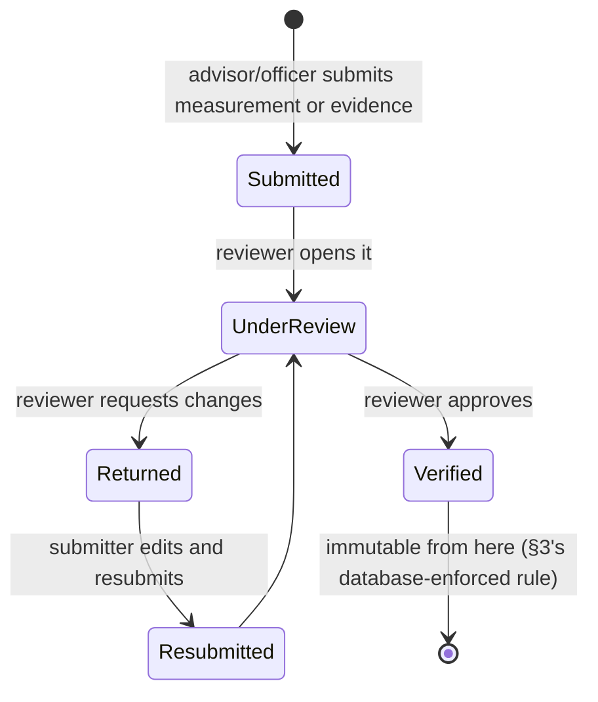
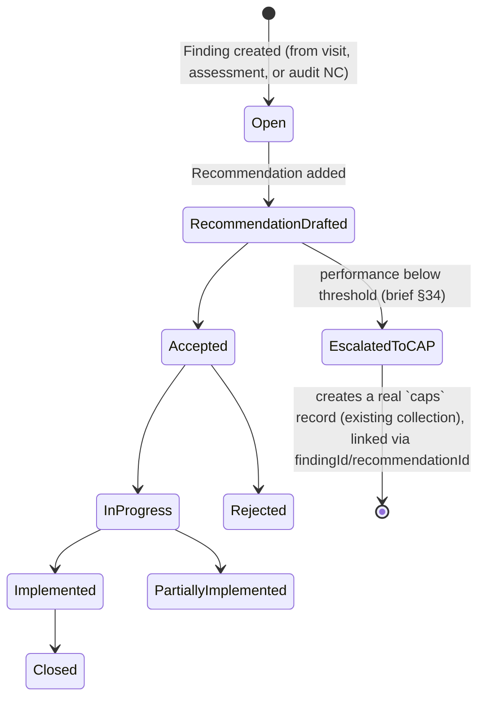

# PAMS — Security Model & Workflow

## 1. Honest starting point

ASMS's current security model is: any real (non-anonymous) signed-in
account, of any role, can read and write the entire Firestore database
directly through the SDK — `hasPerm()`/`inScope()` are UI-layer gates
only, not enforcement (confirmed by reading `firestore.rules`, which
checks only "is this a real signed-in user," never role or ownership).
This is a documented, accepted tradeoff for ASMS's current scope — see
`README.md` and the comment block at the top of `firestore.rules`.

The originating PAMS brief has a hard rule that conflicts with this:
*"Do not put authorization only in the frontend"* (§92 rule 11). Since
the user has chosen to keep PAMS inside ASMS's existing
no-backend architecture, a from-scratch server-enforced RBAC system
(what that rule implies in the brief's original ASP.NET-Core context)
is not available. What follows is the closest honest equivalent
achievable purely with Firestore, and it is a **real, meaningful
improvement over today's baseline** — not a restatement of the same
limitation with different words.

## 2. Roles and the permission matrix (extends the existing pattern)

PAMS reuses ASMS's exact 4-role model (`admin/manager/officer/user`) and
its existing per-module `{view, edit, delete}` permission-matrix
pattern (`PERMISSION_MODULES`, `defaultPermissions()`,
`PermissionMatrix` UI) — no new role concept, no new permission UI
paradigm, matching PRD.md §4's decision. New module keys are added to
the same fixed list the existing 14 use:

```
pams.factories        pams.projects           pams.assessments
pams.goals              pams.objectives           pams.subObjectives
pams.targets              pams.kpis                   pams.measurements
pams.actions                pams.tasks                   pams.evidence
pams.advisoryVisits            pams.findings                pams.recommendations
pams.correctiveActions           pams.risks                    pams.issues
pams.reviews                       pams.reports                    pams.scoringConfig  (admin-only in practice)
pams.dashboard
```

Each carries `{view, edit, delete}` exactly like existing modules, set
per role via the same `PermissionMatrix` screen — no new concept for
an admin to learn. `pams.scoringConfig` (rating scales, RAG rules,
scoring rule versions, weight schemes) is deliberately its own module
key, separate from ordinary data entry modules, so an organization can
grant `officer` write access to measurements/actions/findings without
also granting the ability to change how scores are calculated — a
distinction the brief's own permission examples make (`goal.approve`
vs `goal.edit`, `assessment.verify` vs `assessment.submit`) that
ASMS's flat `{view,edit,delete}` triple doesn't natively express.
Where the brief wants a finer split than view/edit/delete provides
(submit vs. verify, edit vs. approve), PAMS adds a **status-gated edit
rule** instead of a new permission verb — see §4.

Company-scoped `user` accounts keep working exactly as today:
`inScope(ctx, factoryId)` (renamed generically from `companyId`, same
mechanism) filters every PAMS query the same way it filters every
existing module's list.

## 3. Firestore Security Rules — real enforcement for the first time

Because PAMS collections are real per-record documents
(ARCHITECTURE.md §2), not one giant blob, they can finally carry
**field-based Firestore rules** — something the existing
`advisoryDeskShared/{document=**}` blob structurally cannot support
(a rule can't inspect "does this array element belong to the
requester's factory" the way it can inspect a real document's own
field). This is a genuine capability upgrade PAMS brings to the whole
app, not just to itself.

Baseline (matches existing behavior — every real signed-in account,
any role, may read/write): kept as the floor, since PAMS still doesn't
have server-side knowledge of which of the 4 roles a given `request.auth.uid`
maps to unless that's added to the Firebase Auth custom-claims token
(§5). What Firestore rules *can* enforce today, without any new
infrastructure:

```
rules_version = '2';
service cloud.firestore {
  match /databases/{database}/documents {

    // Existing rule, unchanged.
    match /advisoryDeskShared/{document=**} {
      allow read: if request.auth != null;
      allow write: if request.auth != null
        && request.auth.token.firebase.sign_in_provider != 'anonymous';
    }

    // PAMS collections: same non-anonymous-write floor as today,
    // PLUS structural validation Firestore rules CAN express even
    // without custom claims — field presence/type, and (critically)
    // immutability of verified records.
    match /pams_measurements/{id} {
      allow read: if request.auth != null;
      allow create: if request.auth != null
        && request.auth.token.firebase.sign_in_provider != 'anonymous'
        && request.resource.data.keys().hasAll(['kpiLinkId','targetId','period','actualValue','submittedBy']);
      // A VERIFIED measurement can never be updated by anyone through
      // this path — only a new superseding document may be created
      // (DOMAIN_MODEL.md §3). This is enforced here, at the database
      // layer, not just by the UI hiding the edit button.
      allow update: if request.auth != null
        && request.auth.token.firebase.sign_in_provider != 'anonymous'
        && resource.data.verificationStatus != 'Verified';
      allow delete: if false;   // measurements are never deleted, only superseded
    }

    match /pams_scores/{id} {
      allow read: if request.auth != null;
      // Scores are written ONLY by the scoring engine (pamsStore.js),
      // never hand-edited — no update/delete rule at all means both
      // are rejected by default; only create is allowed.
      allow create: if request.auth != null
        && request.auth.token.firebase.sign_in_provider != 'anonymous';
      allow update, delete: if false;
    }

    match /pams_{collection}/{id} {
      allow read: if request.auth != null;
      allow write: if request.auth != null
        && request.auth.token.firebase.sign_in_provider != 'anonymous';
    }
  }
}
```

This is a real, meaningful floor: it makes "a verified measurement can
be silently edited" and "a score can be hand-typed instead of
calculated" **impossible at the database layer**, closing exactly the
two integrity gaps that would matter most for an advisory program's
credibility, even before any role-aware rule exists.

## 4. Status-gated editing (the brief's segregation-of-duties rules,
   adapted)

Brief §89 wants things like "closed action cannot be edited without
reopening" and "user cannot approve their own record." Without custom
claims, Firestore rules can't check *who* is approving against *who*
submitted (that needs the requester's role/identity server-side, §5).
What PAMS does today, in `pamsStore.js` (client-enforced, same honesty
caveat as the rest of this document) plus the measurement-immutability
rule above (which *is* database-enforced):

- Editing a `Closed`/`Verified`/`Approved` record requires an explicit
  "Reopen" action first, which itself is a status transition logged to
  `pams_audit_logs` — never a silent direct edit.
- The UI disables the Verify/Approve action when
  `currentUser.uid === record.submittedBy` (segregation of duties),
  same enforcement level as the rest of ASMS's permission checks today
  — real, but UI-layer, until §5 ships.

## 5. What's explicitly not solved yet, and the real fix

Firestore rules cannot know a user's `admin/manager/officer/user` role
or their assigned `factoryId` without one of:

1. **Firebase Auth custom claims** — a small Cloud Function, triggered
   on `users` record changes, that calls
   `admin.auth().setCustomUserClaims(uid, {role, factoryId})`. Rules
   then read `request.auth.token.role`/`request.auth.token.factoryId`
   directly. This is the standard, supported Firebase pattern for
   exactly this problem — it does **not** require standing up a
   backend server (Cloud Functions run inside the same Firebase
   project) and is scoped as a concrete Phase 8 follow-up
   (ROADMAP.md), not a "someday, maybe."
2. Until then, PAMS's factory-scoping and role-gating remain UI-layer,
   identical in strength to every other ASMS module today — not a
   regression, just not yet the brief's full ask. This is stated
   plainly rather than glossed over, per this project's own standing
   rule to never claim more rigor than what was actually verified.

## 6. Workflow: evidence & measurement verification



Applies identically to `pams_measurements` and `pams_evidence`
(brief §41). The `verifiedBy` user must differ from `submittedBy`
(§4's segregation-of-duties check) whenever the acting role is
`officer` or `user`; `admin`/`manager` may self-verify, matching how
ASMS already treats those two roles as trusted throughout the existing
app (e.g. `admin` bypasses `hasPerm()` entirely today).

## 7. Workflow: finding → recommendation → CAP escalation



The "performance below threshold" auto-escalation trigger (brief §34)
is evaluated the same way the escalation levels in ARCHITECTURE.md §5
are — computed on read/write, not on a schedule, since there's no job
runner. When a Target's score drops into the Red RAG band, the target
detail screen surfaces a prominent "Create CAP" prompt rather than
silently auto-creating one — matching this project's general "never
take a consequential action without a human confirming it" bias, and
avoiding a flood of auto-generated CAPs from a single bad measurement
period.

## 8. Data validation (brief §89), where it actually lives

Every rule in the brief's §89 list is enforced in `pamsStore.js`
before any Firestore write is attempted (client-side, same honesty
caveat as §4-5), with the two exceptions in §3 that are also enforced
by Firestore rules directly:

| Rule | Enforced in |
|---|---|
| Verified measurement cannot be changed without authorization | **Firestore rule** (§3) — real, database-level |
| Score cannot be hand-edited | **Firestore rule** (§3) — real, database-level |
| Start date ≤ end date | `pamsStore.js` validation |
| Weight cannot be negative / sibling group sums to 100% | `pamsStore.js` validation (SCORING_ENGINE.md §9) |
| Required evidence must be supplied where configured | `pamsStore.js` validation, checked against `pams_actions.evidenceRequired` |
| Closed action cannot be edited without reopening | `pamsStore.js` status-gate (§4) |
| Approved objective cannot be modified without versioning | `pamsStore.js` — writes a new version snapshot, see DOMAIN_MODEL.md's audit-log pattern, before allowing the edit |
| User cannot approve their own record | `pamsStore.js` (§4), UI-disabled |
| Actual value unit must match target unit | `pamsStore.js`, checked against `pams_targets.unit` |

## 9. Audit log

`pams_audit_logs/{id}`:

```
{ id, userId, timestamp, action, entityType, entityId, oldValue, newValue, reason }
```

Written by every `pamsStore.js` write function for the fields the
brief's §64 calls out specifically (score/target/KPI/weight/action/
deadline changes, evidence verification, approvals, permission
changes). This is PAMS's own change-log, additive to (not a
replacement for) whatever the eventual Firebase Auth audit trail
provides — there is no server-side `SaveChangesInterceptor`-equivalent
to do this automatically, so it is an explicit call in every write
path, which is exactly why keeping all PAMS writes funneled through
`pamsStore.js` (ARCHITECTURE.md §3) matters: it's the one place this
can't be forgotten.
